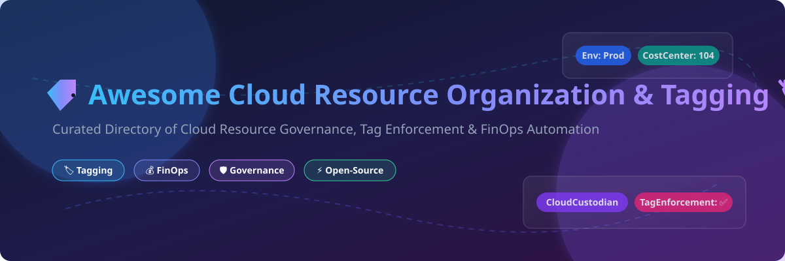

# Awesome-Cloud-Resource-Organization-Tagging 🏷️ ☁️

  

  
  
  
  
  

---

## 🌟 Top Cloud Resource Organization & Tagging Ecosystem

**Curated Directory of Commercial Cloud Tagging Platforms & Open-Source Cloud Governance Tools**  
*Focused on Tag Enforcement, Resource Grouping, Multi-Cloud Cost Allocation, Metadata Governance, Policy-as-Code & Automated Tag Remediation* 🏷️ ⚡

**Last updated: October 2026** 📅

---

### 📌 Overview & FinOps Market Analysis

Welcome to the ultimate curated directory of **cloud resource organization and tagging platforms**, **open-source tag enforcement tools**, and **metadata governance frameworks**. Whether you are looking for enterprise-grade commercial platforms (such as *AWS Resource Groups*, *Turbot Guardrails*, and *Apptio Cloudability*), or self-hostable open-source alternatives (like *Cloud Custodian*, *Komiser*, and *Terratag*), this list covers category leaders, automated tag remediation engines, and privacy-respecting cloud governance.

#### 📊 Market Dynamics & Industry Insights
> The global **Cloud Governance & Management Tools Market** is estimated at **$22.5 Billion** and is projected to reach **$54.8 Billion by 2030**. The market is **moderately fragmented**, featuring a split between tech behemoths/hyperscalers (Amazon, Alphabet, IBM, Broadcom) providing foundational infrastructure visibility, and specialized venture-backed platforms (CloudZero, Vantage, env0, CoreStack) delivering granular unit-economics and IaC automated tagging enforcement.

**Key FinOps Market Context:**
- **Tagging is the core foundation of FinOps** 💰 — without consistent metadata tags, cost allocation, showback, and chargeback across multi-cloud environments are impossible.
- **Automated Policy Enforcement** 🛡️ — **Cloud Custodian**'s stateless YAML rules engine remains the gold standard for real-time compliance enforcement and automated tag remediation.
- **Infrastructure-as-Code (IaC) Tagging** 📐 — Tools like **Terratag** automatically propagate mandatory tags across Terraform and Terragrunt modules before resource deployment.

---

## 📑 Table of Contents
- [🏢 SaaS & Commercial Platforms](#-saas--commercial-platforms)
- [🔓 Open-Source GitHub Projects](#-open-source-github-projects)
- [🛠️ How to Contribute](#%EF%B8%8F-how-to-contribute)
- [📊 Star History](#-star-history)
- [🤝 Support & Sponsorship](#-support--sponsorship)
- [⚠️ Disclaimer](#%EF%B8%8F-disclaimer)

---

## 🏢 SaaS & Commercial Platforms

The cloud resource organization and tagging market spans **hyperscaler native services** providing free tag-based grouping and **specialized governance platforms** offering automated enforcement and showback/chargeback.

*Sorted by Valuation / Market Cap / Revenue (Descending)* 📈

| SaaS / Commercial Platform 🏢 | Company / Owner 🤝 | Valuation / Market Cap / Revenue 💵 | Standard Edition Starting Price 💰 | Free Tier / Free Trial Limits 🎁 | Description 📝 |
| :--- | :--- | :--- | :--- | :--- | :--- |
| **[AWS Resource Groups & Tag Editor](https://aws.amazon.com/resource-groups/)** ☁️ | Amazon | ~$2.0 Trillion | **Free service** (Pay only for underlying AWS infrastructure consumed) | **Free forever** with unlimited tag-based resource grouping | **AWS-native resource organization** — Tag-based grouping for EC2, S3, RDS, Lambda. **Tag Editor** for bulk tagging across services & regions. Tag policies in AWS Organizations for governance enforcement. 🏷️ |
| **[StratoZone](https://cloud.google.com/migration-center)** 🌐 | Google (Alphabet) | ~$2.0 Trillion | **Free** (Included with Google Cloud Migration Center) | **Free forever** with agentless discovery collector | **Agentless asset discovery & grouping** — StratoProbe data collector installs in <45 mins. Tag-based asset grouping for GCP migration and governance assessment. 🌐 |
| **[Apptio Cloudability](https://www.apptio.com/products/cloudability/)** 💰 | IBM (Apptio) | ~$200 Billion | **$2,500/month** (Base tier covering up to $1M managed cloud spend) | **Free tier: Up to 3 cloud accounts** with basic cost reporting | **Percentage-of-spend FinOps platform** — Allocates 100% of multi-cloud costs including containers and shared services via tag-based cost allocation. 📊 |
| **[CloudHealth](https://www.cloudhealthtech.com/)** 🏥 | Broadcom (VMware) | ~$60 Billion | **$4/day per tag value** ($120/month per active tag structure) | **14-day free trial** with full account analysis features | **Multi-cloud cost governance** — Tag-based pricing allocation, rightsizing reports, and governance recommendations across AWS, Azure, and GCP. 🏥 |
| **[CloudZero](https://www.cloudzero.com/)** 📊 | CloudZero | ~$500 Million (Valuation) | **$1,500/month** (Platform starting tier) | **14-day free trial** with custom telemetry ingestion | **Unit economics platform** — Organizes costs by customer, team, or feature using tag telemetry and code artifact metadata. 💡 |
| **[CoreStack](https://www.corestack.io/)** 🤖 | CoreStack | ~$250 Million (Valuation) | **$1,000/month** (Tier 1 covering up to $600K cloud spend) | **30-day free trial** for up to 5 multi-cloud accounts | **AI-powered Agentic Governance OS** — Unifies FinOps, SecOps, and CloudOps. Uses Large Cloud Governance Models (LCGM) for automated tag enforcement. 🤖 |
| **[Turbot Guardrails](https://turbot.com/guardrails)** 🛡️ | Turbot | ~$100 Million (Valuation) | **$0.05/control/month** (SaaS) or **$0.10/control/month** (Enterprise) | **14-day free trial** (SaaS) with up to 500 active controls | **Preventive Cloud Security & Tag Enforcement** — Blocks non-compliant untagged deployments in real time via CloudTrail event interception. 🛡️ |
| **[Vantage Tag Manager](https://www.vantage.sh/)** 💰 | Vantage | ~$80 Million (Valuation) | **$30/month + 3% managed spend** (Pro Plan) | **Free Tier: 2 cloud accounts & 10 cost reports** | **Cloud cost transparency & tagging** — Tag Manager enforces tagging compliance, unallocated cost visibility, and automated savings recommendations. ⚡ |
| **[GorillaStack](https://www.gorillastack.com/)** 🦍 | GorillaStack | ~$20 Million (Revenue) | **$450/month** (Team Starter Plan) | **14-day free trial** for up to 10 AWS/Azure accounts | **Cloud automation & tagging workflows** — Automated tag enforcement, off-hours resource scheduling, and automated governance rules. 🦍 |
| **[ParkMyCloud](https://www.parkmycloud.com/)** 🅿️ | ParkMyCloud | ~$15 Million (Revenue) | **$3/parked resource/month** (Light Plan) | **14-day free trial** with automated resource parking | **Tag-based resource parking & optimization** — Automatically toggles non-production EC2, RDS, and Azure VMs based on tag schedules. 🅿️ |

---

## 🔓 Open-Source GitHub Projects

*Sorted by GitHub Stars Count (Descending)* 🌟

- **[Checkov](https://github.com/bridgecrewio/checkov)**   
  **Static analysis for IaC & tag compliance**, Apache-2.0 licensed. **Scans Terraform, CloudFormation, Kubernetes, and ARM templates** for security and mandatory tagging policy violations before deployment. Features plan-aware scanning and SARIF integration. 🔍

- **[Cloud Custodian](https://github.com/cloud-custodian/cloud-custodian)**   
  **Rules engine for cloud security, cost optimization, and tag governance**, Apache-2.0 licensed. **CNCF Incubating Project**. Stateless YAML policy engine supporting AWS, Azure, GCP, OCI, and K8s. Tag enforcement is its most widely deployed use case — automatically identifying untagged resources and executing remediation actions. 🏷️

- **[Steampipe](https://github.com/turbot/steampipe)**   
  **Query cloud APIs with SQL**, AGPL-3.0 licensed. Zero-ETL engine allowing DevOps and FinOps teams to write SQL queries against AWS, Azure, GCP, and Kubernetes metadata to quickly detect untagged or misconfigured cloud resources. 🔗

- **[CloudQuery](https://github.com/cloudquery/cloudquery)**   
  **High-performance cloud asset inventory & extraction framework**, MPL-2.0 licensed. Extracts multi-cloud configuration data into PostgreSQL or Snowflake for automated tag governance dashboards and security reporting. 📦

- **[Komiser](https://github.com/tailwarden/komiser)**   
  **Cloud resource visibility & inventory dashboard**, Apache-2.0 licensed. Multi-cloud dashboard for AWS, Azure, GCP, OCI, DigitalOcean, and K8s. Detects unallocated costs, orphaned volumes, and untagged resources instantly. 🌐

- **[Infracost](https://github.com/infracost/infracost)**   
  **Cloud cost estimates for Terraform in pull requests**, Apache-2.0 licensed. Shows cloud cost estimates and missing mandatory tag guardrails directly within GitHub PRs before infrastructure code is merged. 💰

- **[Trivy](https://github.com/aquasecurity/trivy)**   
  **Comprehensive security & IaC compliance scanner**, Apache-2.0 licensed. Includes built-in misconfiguration checks for Terraform and AWS CloudFormation to validate resource tagging rules. 🛡️

- **[Terratag](https://github.com/env0/terratag)**   
  **Automatic tagging CLI for Terraform & Terragrunt**, MPL-2.0 licensed. Automatically injects custom tags and labels across entire Terraform codebases for AWS, GCP, and Azure without manual code edits. 🏷️

- **[Yor](https://github.com/bridgecrewio/yor)**   
  **Auto-tagging tool for Infrastructure-as-Code**, Apache-2.0 licensed. Automatically adds git ownership, git commit details, and custom organizational tags to Terraform, CloudFormation, and Serverless framework templates. 🏷️

- **[tflint](https://github.com/terraform-linters/tflint)**   
  **Pluggable Terraform linter**, MIT licensed. Enforces naming conventions and required provider tag structures across multi-cloud Terraform modules. 📐

- **[Cloud Custodian Tag Policies (AWS Samples)](https://github.com/aws-samples/cloud-custodian-tag-policies)**   
  **AWS sample tag enforcement policies**, Apache-2.0 licensed. Ready-to-use production recipes for enforcing tags, automated resource notification, and auto-remediation on AWS. 📋

- **[aws-tag-editor](https://github.com/aws-samples/aws-tag-editor)**   
  **Bulk tag management utility for AWS**, MIT licensed. Automated CLI helper to scan, audit, and bulk-update tag keys and values across AWS multi-region setups. 🏷️

- **[terraform-aws-tags](https://github.com/cloudposse/terraform-aws-tags)**   
  **Standardized Terraform AWS tagging module**, Apache-2.0 licensed. Cloud Posse's battle-tested module for generating consistent labels, namespaces, and standard tags across AWS infrastructure. 📐

- **[tag-ops](https://github.com/aws-samples/tag-ops)**   
  **AWS tag operations & governance engine**, Apache-2.0 licensed. Automated tag remediation workflows and multi-account compliance monitoring integrated with AWS Organizations. 🛠️

---

## 🛠️ How to Contribute

Contributions are welcome! Follow these steps to submit new cloud tagging platforms or open-source governance tools:

1. 🍴 **Fork** the repository.
2. 📝 **Add/edit** entries in `README.md` maintaining table/list structure and formatting.
3. 🔗 Include project title, official website/GitHub link, exact star count, license, and brief description.
4. 🚀 Submit a **Pull Request** with a descriptive summary of your changes.

---

## 📊 Star History

---

## 🤝 Support & Sponsorship

If you find this cloud resource organization and tagging repository useful, please consider supporting the project:

- ⭐ **Star** this repository to increase visibility!
- 🔀 **Fork** and share with fellow FinOps engineers, platform teams, and cloud architects.
- ☕ **Sponsor & Buy Me a Coffee**: Support ongoing open-source curation via the [GitHub Sponsor Dashboard](https://github.com/sponsors/ishandutta2007).

---

## ⚠️ Disclaimer

- This is a **community-curated** list — not exhaustive and not an explicit endorsement. ℹ️
- **Tagging is the foundation of FinOps** — without consistent tags, cost allocation, showback, and chargeback are impossible.
- **CloudHealth charges $4–$5/day per tag value** — granular tagging strategies can affect cost structures. Always plan tag key taxonomies carefully. 💡
- **AWS Resource Groups and Tag Editor are free** — you pay only for the underlying resources created.
- **Always start with audit mode before automated tag remediation** — use Cloud Custodian's `mode: audit` or Checkov pre-commit checks before enabling auto-remediation scripts. 🏷️

---

  <b>Made with ❤️ for FinOps engineers, platform teams, and cloud tagging advocates.</b>

